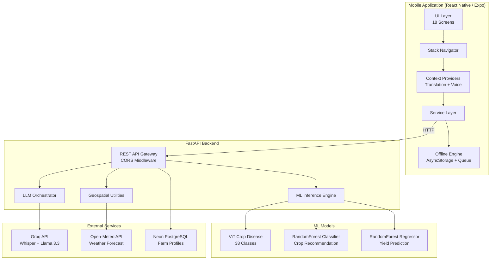
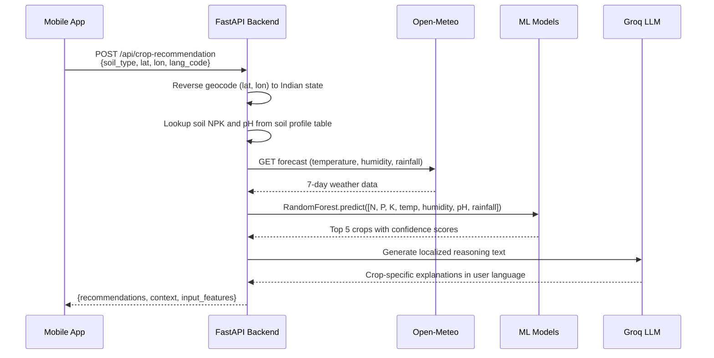
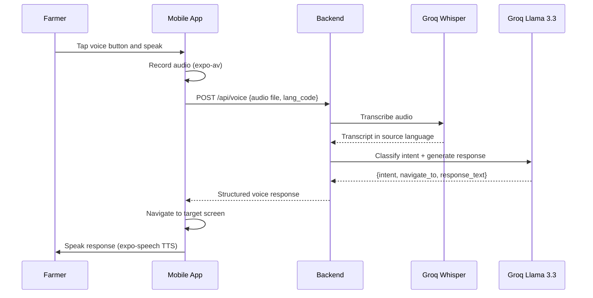
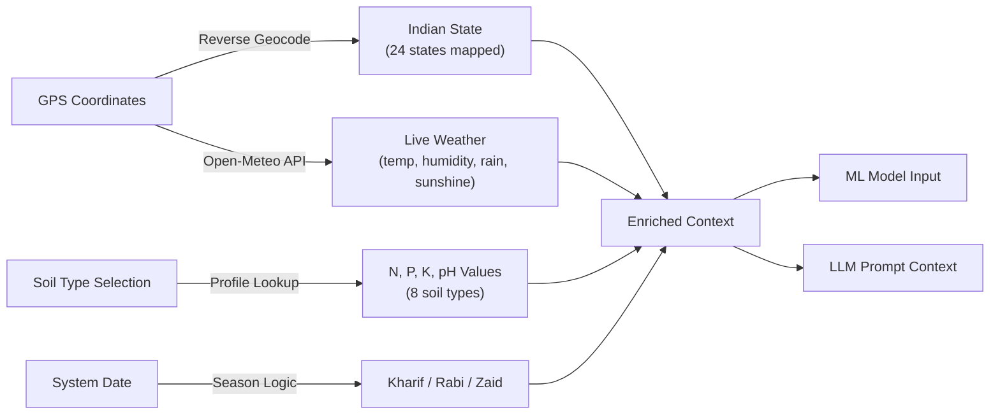
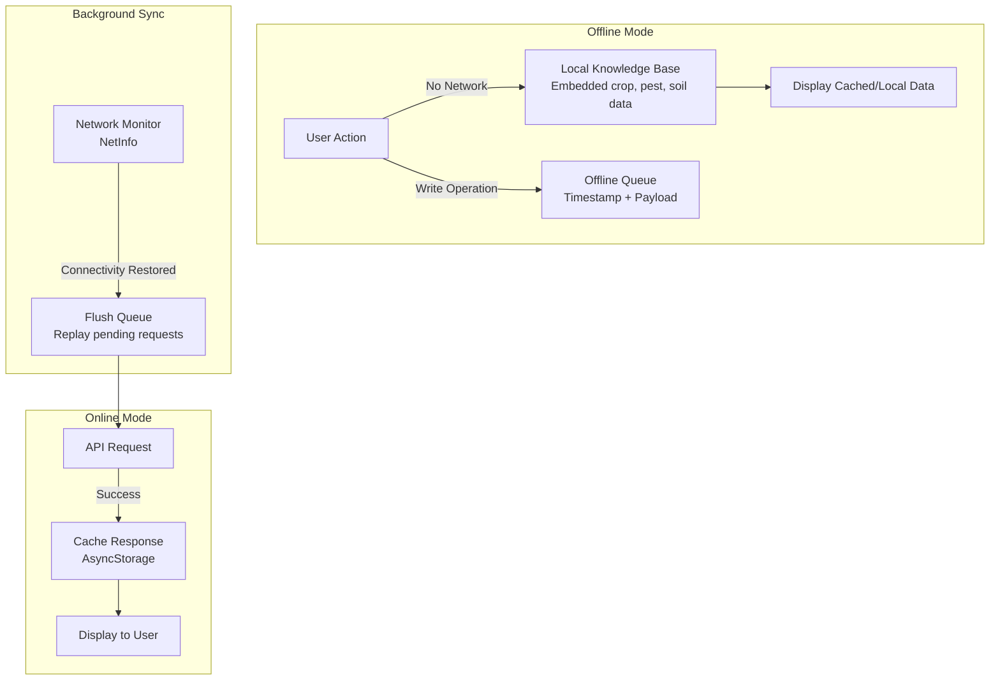

# Smart India Harvest

**An AI-Powered Agricultural Decision Support System for Indian Farmers**

Smart India Harvest is a full-stack mobile platform that combines machine learning, computer vision, and large language models to deliver actionable farming intelligence to smallholder farmers across India. The system operates with an offline-first architecture, ensuring accessibility in rural areas with intermittent connectivity, and supports multilingual interaction in English, Hindi, and Punjabi.

---

## Table of Contents

1. [Problem Statement](#problem-statement)
2. [Solution Overview](#solution-overview)
3. [System Architecture](#system-architecture)
4. [Technology Stack](#technology-stack)
5. [ML Models and AI Pipeline](#ml-models-and-ai-pipeline)
6. [Feature Breakdown](#feature-breakdown)
7. [API Reference](#api-reference)
8. [Data Flow](#data-flow)
9. [Offline-First Architecture](#offline-first-architecture)
10. [Project Structure](#project-structure)
11. [Setup and Installation](#setup-and-installation)
12. [Environment Variables](#environment-variables)
13. [Contributors](#contributors)
14. [License](#license)

---

## Problem Statement

Indian agriculture supports over 58% of the population, yet smallholder farmers face critical challenges:

- **Lack of actionable, localized intelligence** -- generic advice fails to account for region-specific soil, weather, and market conditions.
- **Delayed disease identification** -- crop diseases spread rapidly when detection depends solely on manual inspection.
- **Water mismanagement** -- traditional irrigation scheduling leads to 30--40% water overuse.
- **Language barriers** -- most agri-tech solutions are English-only, excluding a majority of Indian farmers.
- **Poor connectivity** -- rural India has inconsistent internet access, rendering cloud-only apps unusable.

## Solution Overview

Smart India Harvest addresses each challenge with a modular, AI-driven approach:

| Challenge | Solution Module | Approach |
|---|---|---|
| Generic crop advice | Crop Recommendation Engine | RandomForest ML + Groq LLM with real-time weather, soil NPK, and regional context |
| Late disease detection | Disease Detection Scanner | ViT (Vision Transformer) image classification with 38 disease classes |
| Water overuse | Smart Irrigation Dashboard | Hargreaves ET0 computation from live Open-Meteo data with Kc coefficients |
| Yield uncertainty | Yield Prediction Model | RandomForestRegressor trained on historical Indian crop yield data |
| Language barriers | Multilingual Voice Assistant | Groq Whisper transcription + LLM intent classification in 3 languages |
| Connectivity gaps | Offline-First Architecture | AsyncStorage queue, local knowledge base, background sync |

---

## System Architecture

### High-Level Architecture



### Request Processing Pipeline



### Voice Command Pipeline



---

## Technology Stack

### Mobile Application

| Component | Technology | Purpose |
|---|---|---|
| Framework | React Native 0.81 + Expo 54 | Cross-platform mobile development |
| Language | TypeScript | Type-safe application logic |
| Navigation | React Navigation 7 (Stack) | Screen routing with session persistence |
| State | React Context API | Translation and voice state management |
| Storage | AsyncStorage | Offline data persistence |
| Camera | expo-image-picker | Disease detection image capture |
| Location | expo-location | GPS-based regional context |
| Audio | expo-av | Voice command recording |
| TTS | expo-speech | Text-to-speech response playback |
| Biometrics | expo-local-authentication | Fingerprint and face authentication |
| Charts | react-native-chart-kit | Irrigation and yield data visualization |
| Network | @react-native-community/netinfo | Connectivity monitoring |

### Backend

| Component | Technology | Purpose |
|---|---|---|
| Framework | FastAPI | Async REST API with auto-generated docs |
| ML Runtime | PyTorch + scikit-learn | Model inference for disease, crop, and yield |
| Vision Model | HuggingFace ViT | Crop leaf disease classification |
| LLM Gateway | Groq API (Llama 3.3 70B) | Natural language generation and intent classification |
| Speech-to-Text | Groq Whisper Large v3 Turbo | Multilingual audio transcription |
| Weather Data | Open-Meteo API | Real-time and 7-day forecast (no API key required) |
| Database | PostgreSQL (Neon) | Cloud-hosted farm profile storage |
| ORM | SQLModel | Type-safe database operations |

---

## ML Models and AI Pipeline

### 1. Crop Disease Detection (ViT)

- **Model**: `wambugu71/crop_leaf_diseases_vit` (HuggingFace)
- **Architecture**: Vision Transformer (ViT) fine-tuned on crop leaf images
- **Classes**: 38 disease categories across multiple crop species
- **Input**: RGB image of a crop leaf
- **Output**: Top-5 predictions with softmax confidence scores
- **Inference**: Single-pass forward through ViTForImageClassification

### 2. Crop Recommendation (RandomForest Classifier)

- **Model**: `RandomForest.pkl` (MultiOutputClassifier)
- **Features**: Nitrogen (N), Phosphorus (P), Potassium (K), Temperature, Humidity, pH, Rainfall
- **Input Enrichment**: Soil NPK and pH are auto-filled from an 8-type Indian soil profile lookup table; temperature, humidity, and rainfall are fetched live from Open-Meteo
- **Output**: Top 5 crop predictions with probability scores
- **Post-Processing**: Groq LLM generates localized reasoning text explaining why each crop suits the farmer's specific conditions

### 3. Crop Yield Prediction (RandomForest Regressor)

- **Model**: `crop_yield_model.pkl`
- **Features**: Year, State (encoded), Crop (encoded), Latitude, Longitude, Soil pH, Temperature, Humidity, Precipitation, Sunshine Hours
- **State Encoding**: 24 Indian states mapped to integer codes matching training data
- **Crop Encoding**: 51 crops mapped to integer codes
- **Output**: Predicted yield in tonnes per hectare, scaled by land area to total production
- **Fallback**: Groq LLM estimation if ML model fails

### 4. Smart Irrigation (Hargreaves ET0)

This module is computation-based, not ML-based:

- **ET0 Estimation**: Hargreaves equation using daily max/min temperature and extraterrestrial radiation approximated from latitude
- **Crop Water Requirement**: ET0 multiplied by crop coefficient (Kc) at the appropriate growth stage (initial, mid-season, late)
- **Net Irrigation**: Crop ET minus effective rainfall (80% of actual rainfall)
- **Soil Moisture**: Estimated from 3-day rain-ET balance, adjusted by soil retention factor per type

### 5. LLM Orchestration (Groq)

All LLM interactions follow a structured pattern:

- System prompts define the role and enforce JSON-only output
- User prompts include auto-fetched context (weather, soil, GPS, season)
- Responses are parsed with fallback regex extraction for malformed JSON
- Language is controlled via `lang_code` parameter (en/hi/pa)

Groq is used for: crop recommendation reasoning, mandi price generation, yield advisory, irrigation recommendations, action plan generation, voice intent classification, and the AI chat assistant.

---

## Feature Breakdown

### Authentication and Onboarding

- Mobile number and password authentication with local session persistence
- Biometric authentication setup (fingerprint / face recognition)
- Farm onboarding wizard: land size, soil type, previous crop, current status
- Session check on app launch to skip login for returning users

### Home Dashboard

- Time-aware greeting (Good Morning / Afternoon / Evening)
- GPS-based location display
- Quick-access cards: Disease Detection, Crop Management, Yield Prediction, Agricultural Knowledge, Government Schemes, Mandi Prices
- Real-time weather summary tile
- Active crop and health status indicators

### Disease Detection

- Camera capture or gallery image selection
- ViT model inference with top-5 disease predictions
- Confidence scores and disease label display
- AI explainability components showing prediction reasoning

### Crop Management (Fasalein)

- Farm profile display: soil type, current crop, maturity stage
- ML-based crop recommendations with confidence scores
- LLM-generated reasoning per crop in the user's language
- Market demand and estimated price per quintal

### Weather Forecast

- Current conditions: temperature, humidity, wind speed, feels-like
- 24-hour hourly forecast
- 7-day daily forecast with precipitation probability
- Sunrise and sunset times

### Smart Irrigation Dashboard

- Real-time soil moisture estimation
- ET0-based water requirement calculation in liters
- Best irrigation time recommendation
- 7-day irrigation schedule with rain-adjusted needs
- Historical vs AI-optimized water usage comparison with savings percentage
- Interactive usage comparison chart

### Yield Prediction

- ML model prediction in tonnes per hectare
- Land area scaling to total production
- Weather snapshot at prediction time
- LLM-generated advisory tips for yield maximization

### Mandi Prices

- GPS-based regional commodity prices
- MSP (Minimum Support Price) baseline with market premiums
- Price trend indicators (up, down, stable) with percentage changes
- Nearest mandi identification

### 7-Day Action Plan

- Auto-computed crop stage from sowing date
- Weather-aware task generation (no spraying on rainy days)
- Categorized tasks: irrigation, fertilizer, spray, weeding, monitoring
- Exact quantities, costs, and timing per task
- Urgency-based prioritization
- Rule-based fallback if LLM is unavailable

### AI Chat (Krishi Mitra)

- Conversational agricultural assistant
- Quick-ask prompt buttons for common queries
- Multilingual responses matching the app language

### Voice Assistant

- Floating voice button accessible from all screens
- Audio recording, transcription, and intent classification
- Automatic navigation to the relevant screen
- Text-to-speech response playback
- Support for English, Hindi, and Punjabi

### Government Schemes

- Information on central and state agricultural schemes
- Eligibility criteria and benefit details

### Agricultural Knowledge Base

- Offline-accessible farming knowledge
- Regional and crop-specific guidance

### Success Stories

- Farmer success story feed
- Community contribution with story submission

### Profile

- Farm profile display and management
- Language switching
- App settings

---

## API Reference

| Method | Endpoint | Description |
|---|---|---|
| `GET` | `/` | Health check root |
| `GET` | `/api/health` | Server and model status |
| `POST` | `/api/onboarding` | Create or update farm profile |
| `GET` | `/api/farm-profile/{user_id}` | Retrieve farm profile |
| `POST` | `/api/detect-disease` | Upload leaf image for disease classification |
| `GET` | `/api/model-labels` | List all disease model labels |
| `GET` | `/api/translations/{lang_code}` | Get UI translations (en, hi, pa) |
| `POST` | `/api/voice` | Voice command processing (audio + lang_code) |
| `POST` | `/api/crop-recommendation` | ML + LLM crop recommendations |
| `GET` | `/api/mandi-prices` | Regional commodity market prices |
| `POST` | `/api/yield-prediction` | ML crop yield prediction |
| `GET` | `/api/irrigation/dashboard` | ET0-based irrigation dashboard |
| `POST` | `/api/action-plan` | 7-day farm action plan generation |

---

## Data Flow

### Context Auto-Enrichment

Every analytical endpoint follows the same enrichment pattern, minimizing user input:



### Soil Profile Lookup Table

| Soil Type | N | P | K | pH |
|---|---|---|---|---|
| Alluvial | 80 | 40 | 45 | 7.0 |
| Black | 55 | 25 | 60 | 7.8 |
| Red | 40 | 20 | 30 | 6.0 |
| Laterite | 35 | 15 | 25 | 5.5 |
| Sandy | 25 | 10 | 15 | 6.5 |
| Clay | 70 | 35 | 55 | 7.5 |
| Loamy | 75 | 42 | 50 | 6.8 |
| Saline | 30 | 12 | 20 | 8.5 |

---

## Offline-First Architecture



Key components:

- **offlineStorage.ts**: AsyncStorage wrapper for caching API responses with TTL
- **offlineQueue.ts**: Queue for pending write operations, replayed on reconnection
- **offlineKnowledgeBase.ts**: Embedded agricultural data accessible without network
- **networkService.ts**: NetInfo-based connectivity monitoring with event listeners
- **OfflineBanner.tsx**: Visual indicator when the app is operating offline

---

## Project Structure

```
smart-india-harvest/
|-- backend/
|   |-- main.py                    # FastAPI application (all endpoints)
|   |-- database.py                # PostgreSQL connection (SQLModel + Neon)
|   |-- models.py                  # Database schemas (FarmProfile)
|   |-- requirements.txt           # Python dependencies
|   |-- RandomForest.pkl           # Crop recommendation model
|   |-- crop_yield_model.pkl       # Yield prediction model
|   |-- .env                       # Environment variables (not committed)
|
|-- mobile-app/
|   |-- App.tsx                    # Root component with providers
|   |-- index.ts                   # Expo entry point
|   |-- app.json                   # Expo configuration
|   |-- package.json               # Node dependencies
|   |
|   |-- src/
|       |-- config.ts              # Centralized backend IP configuration
|       |
|       |-- context/
|       |   |-- TranslationContext.tsx   # i18n provider (en/hi/pa)
|       |   |-- VoiceContext.tsx         # Voice assistant state
|       |
|       |-- navigation/
|       |   |-- AppNavigator.tsx        # Stack navigator (18 routes)
|       |
|       |-- components/
|       |   |-- ExplainabilityComponents.tsx  # AI prediction explainers
|       |   |-- OfflineBanner.tsx        # Network status indicator
|       |   |-- PremiumIcons.tsx         # Custom SVG icon set
|       |   |-- VoiceButton.tsx          # Floating voice FAB
|       |   |-- VoiceOverlay.tsx         # Voice interaction modal
|       |
|       |-- screens/
|       |   |-- LanguageSelectionScreen.tsx
|       |   |-- SignUpScreen.tsx
|       |   |-- LoginScreen.tsx
|       |   |-- BiometricSetupScreen.tsx
|       |   |-- OnboardingScreen.tsx
|       |   |-- HomeScreen.tsx
|       |   |-- WeatherScreen.tsx
|       |   |-- DiseaseDetectionScreen.tsx
|       |   |-- FasaleinScreen.tsx
|       |   |-- AIChatScreen.tsx
|       |   |-- YieldPredictionScreen.tsx
|       |   |-- IrrigationDashboardScreen.tsx
|       |   |-- MandiPricesScreen.tsx
|       |   |-- ActionPlanScreen.tsx
|       |   |-- GovSchemesScreen.tsx
|       |   |-- AgriKnowledgeScreen.tsx
|       |   |-- SuccessStoriesScreen.tsx
|       |   |-- ProfileScreen.tsx
|       |
|       |-- services/
|           |-- aiService.ts            # Groq chat integration
|           |-- diseaseService.ts        # Disease detection API client
|           |-- translationService.ts    # Translation fetching + cache
|           |-- voiceService.ts          # Audio recording + voice API
|           |-- weatherService.ts        # Weather API client
|           |-- networkService.ts        # Connectivity monitoring
|           |-- offlineStorage.ts        # AsyncStorage caching layer
|           |-- offlineQueue.ts          # Pending request queue
|           |-- offlineKnowledgeBase.ts  # Embedded agri knowledge
|
|-- research_paper.tex              # LaTeX research paper
|-- srs_document.tex                # Software Requirements Specification
|-- references.bib                  # Bibliography
```

---

## Setup and Installation

### Prerequisites

- Python 3.10 or higher
- Node.js 18 or higher
- Expo CLI (`npm install -g expo-cli`)
- A physical Android or iOS device with Expo Go installed
- PostgreSQL database (Neon recommended for cloud hosting)

### Backend Setup

```bash
cd backend

# Create and activate virtual environment
python -m venv venv
.\venv\Scripts\activate        # Windows
source venv/bin/activate       # macOS / Linux

# Install dependencies
pip install -r requirements.txt

# Configure environment variables (see section below)
cp .env.example .env
# Edit .env with your credentials

# Start the development server
uvicorn main:app --host 0.0.0.0 --port 8000 --reload
```

The server will be available at `http://<your-ip>:8000`. The `--host 0.0.0.0` flag is required for the mobile app to connect over the local network.

### Mobile App Setup

```bash
cd mobile-app

# Install dependencies
npm install

# Update backend IP address
# Edit src/config.ts and set BACKEND_IP to your machine's local IP
# Find your IP: ipconfig (Windows) or ifconfig (macOS/Linux)

# Start Expo development server
npx expo start --clear
```

Scan the QR code with Expo Go on your device to launch the app.

---

## Environment Variables

Create a `.env` file in the `backend/` directory:

```env
DATABASE_URL=postgresql://<user>:<password>@<host>/<database>?sslmode=require
GROQ_API_KEY=gsk_your_groq_api_key_here
```

| Variable | Required | Description |
|---|---|---|
| `DATABASE_URL` | Yes | PostgreSQL connection string (Neon or local) |
| `GROQ_API_KEY` | Yes | API key for Groq (Whisper + Llama 3.3 70B) |

The Open-Meteo weather API is free and does not require an API key.

---

## Contributors

- **Team Smart India Harvest** -- Built for the Smart India Hackathon

---

## License

This project was developed as part of the Smart India Hackathon and is intended for academic and demonstration purposes.
